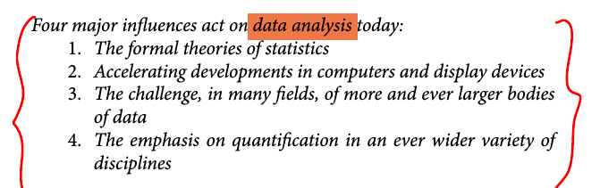

% *Data, data, data*
% `ENVS615` | Dani Arribas-Bel

#
##

* *Why* Data Science?
* *What* is Data Science?

#
## *Why?*
## Data, data, data
## {data-background=../figs/d1s1_new_data.png data-background-size=contain data-transition=none}
## {data-background=../figs/d1s1_data.jpg data-background-size=cover data-transition=none data-transition=none}

*Accidental* data (Arribas-Bel, 2014)

* Availability is a *side effect*
* *More* data, *more* often, of *more* places
* Different (shape, form, nature, quality...)

## {data-background=../figs/d1s1_data.jpg data-background-size=cover data-transition=none data-transition=none}

Lazer & Radford (2017)

* Digital life ("the *fraction of life [that is] intrinsically digitally mediated*")
* Digital traces ("*records that chronicle actions taken*")
* Digitalized life ("*nonintrinsically digital life [...] in digital form*")

## But...

Data, in itself, is not very useful... *insights* are

 Data Science

#
## *What?*

## {data-background=../figs/d1s1_naur.png data-background-size=contain data-transition=none data-transition=none}

## Tukey (1962)

## {data-background=../figs/d1s1_sexy.png data-background-size=contain data-transition=none data-transition=none}
## {data-background=../figs/d1s1_donoho.png data-background-size=contain data-transition=none data-transition=none}

## Greater Data Science (Donoho, 2017)

+ `GDS1`: Data Gathering, Preparation, and Exploration
+ `GDS2`: Data Representation and Transformation
+ `GDS3`: Computing with Data
+ `GDS4`: Data Visualisation and Presentation
+ `GDS5`: Data Modeling
+ `GDS6`: Science about Data Science

#
  "Data, data, data"  by <a xmlns:cc="http://creativecommons.org/ns#" href="http://darribas.org" property="cc:attributionName" rel="cc:attributionURL">Dani Arribas-Bel</a> is licensed under a <a rel="license" href="http://creativecommons.org/licenses/by-sa/4.0/">Creative Commons Attribution-ShareAlike 4.0 International License</a>.

